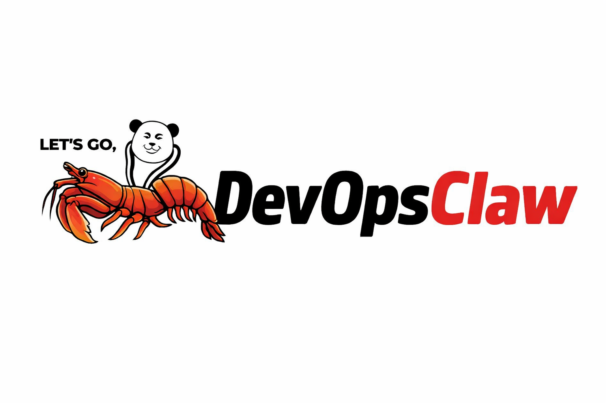

<div align="center">



**Production-grade AI DevOps platform. Single binary. Fleet-scale.**

[](https://go.dev)
[](LICENSE)
[](#installation)

</div>

---

DevOpsClaw is a CLI-first DevOps automation platform written in Go. It connects to LLM providers, executes tools across infrastructure, manages fleet-wide deployments, runs versioned runbooks, and integrates with chat platforms — all from a single binary.

## PicoClaw vs OpenClaw vs DevOpsClaw

All three projects share the same Go codebase lineage. DevOpsClaw is a production-hardened fork that adds fleet-scale infrastructure management on top of the original AI agent.

| | **PicoClaw** | **OpenClaw** | **DevOpsClaw** |
|---|---|---|---|
| **Focus** | Ultra-lightweight AI assistant | Community AI agent | Production DevOps platform |
| **Target** | Embedded / edge devices (64MB RAM) | Developers, hobbyists | DevOps / SRE / platform teams |
| **Fleet management** | No | No | Yes — multi-node targeting, fan-out execution |
| **Deployment strategies** | No | No | Yes — rolling, canary, blue-green with rollback |
| **Relay / NAT traversal** | No | No | Yes — WSS tunnels, no inbound ports on nodes |
| **Runbooks** | No | No | Yes — YAML-defined, versioned, audited workflows |
| **RBAC** | No | No | Yes — tool-level permissions per user role |
| **Audit trail** | No | No | Yes — append-only log of all operations |
| **Browser automation** | No | Basic | Yes — headless Chrome via go-rod |
| **Chat platforms** | Limited | Full | Full — Telegram, Discord, Slack, DingTalk, etc. |
| **LLM providers** | Few | 14+ | 14+ with load balancing |
| **Security sandbox** | Basic | Basic | Hardened — RBAC + workspace restriction + command blocklist |
| **Observability** | No | Basic | Prometheus metrics, tracing, task history |
| **Migration path** | — | `devopsclaw migrate` imports OpenClaw config | — |

**Why DevOpsClaw for production:**

- **You manage servers.** DevOpsClaw can register your fleet, execute commands across nodes, and deploy services with strategies — PicoClaw and OpenClaw cannot.
- **You need accountability.** Every fleet execution, deployment, and runbook run is logged to an immutable audit trail.
- **You need access control.** RBAC ensures your Telegram bot viewer can't run `rm -rf /` on production.
- **You're behind NAT.** The relay lets nodes connect outbound — no VPNs, no port forwarding, no SSH bastion hosts.
- **You have runbooks in Notion/Google Docs.** Move them to version-controlled YAML that actually executes and is audited.

Coming from OpenClaw? Run `devopsclaw migrate` to import your existing configuration and workspace.

## Features

| Category | Capabilities |
|---|---|
| **AI Agent** | Interactive chat, one-shot queries, tool calling, web search, memory |
| **Fleet Management** | Multi-node targeting by tags/environment, fan-out execution, concurrency control |
| **Deployments** | Rolling, canary, blue-green strategies with automatic rollback and health checks |
| **Runbooks** | YAML-defined versioned workflows with shell steps, approval gates, variable capture |
| **Relay** | NAT-safe WebSocket tunnels — nodes connect outbound, no inbound ports required |
| **Browser Automation** | Headless Chrome via go-rod: navigate, click, screenshot, extract data |
| **Chat Platforms** | Telegram, Discord, Slack, DingTalk, LINE, WeCom, QQ, Feishu, WhatsApp, OneBot |
| **RBAC** | Tool-level permission enforcement per user role (admin, operator, viewer) |
| **Audit Trail** | Append-only log of all fleet executions, deployments, runbook runs, browser actions |
| **Observability** | Prometheus metrics, tracing, task history |
| **Resilience** | Circuit breakers, rate limiting, retries, bulkheads |
| **Security Sandbox** | Workspace-restricted file and command access, destructive command blocklist |
| **Cron & Heartbeat** | Scheduled jobs and periodic agent-driven automation |
| **Skills** | 35 built-in DevOps skills (AWS, Azure, GCP, Terraform, K8s, Docker, and more) plus registry install |
| **LLM Providers** | OpenAI, Anthropic, DeepSeek, Gemini, Groq, Ollama, OpenRouter, Cerebras, VLLM, and 6 more |

## Installation

### Build from source

```bash
git clone https://github.com/freitascorp/devopsclaw.git
cd devopsclaw
make build          # → build/devopsclaw
make install        # → ~/.local/bin/devopsclaw
```

### Cross-compile

```bash
make build-all
# Outputs: linux/amd64, linux/arm64, linux/riscv64, darwin/arm64, windows/amd64
```

### Docker

```bash
cp config/config.example.json config/config.json
# Edit config.json with your API keys

docker compose --profile gateway up -d              # Long-running bot
docker compose run --rm devopsclaw-agent -m "Hello" # One-shot
```

### Prebuilt binaries

Download from [Releases](https://github.com/freitascorp/devopsclaw/releases).

## Quick Start

```bash
# 1. Initialize configuration and workspace
devopsclaw onboard

# 2. Edit ~/.devopsclaw/config.json — add at minimum one LLM provider:
{
  "model_list": [
    {
      "model_name": "gpt4",
      "model": "openai/gpt-5.2",
      "api_key": "sk-your-key"
    }
  ],
  "agents": { "defaults": { "model": "gpt4" } }
}

# 3. Run
devopsclaw agent -m "List all running Docker containers and their resource usage"

# Or start an interactive session
devopsclaw agent
```

## DevOps Walkthrough: Managing 3 Servers

This end-to-end example shows how to set up DevOpsClaw to manage a small production environment: two web servers and one API server.

### Scenario

```
Your laptop (control plane)         3 production servers
┌──────────────┐                    ┌──────────────────────┐
│  devopsclaw   │◄──── relay ──────►│ prod-web-1  10.0.1.10│
│  (your Mac)   │                   │ prod-web-2  10.0.1.11│
│              │                    │ prod-api-1  10.0.2.20│
└──────────────┘                    └──────────────────────┘
```

### Step 1: Install DevOpsClaw everywhere

On your laptop and on each server:

```bash
# Build from source (or download a release binary)
git clone https://github.com/freitascorp/devopsclaw.git
cd devopsclaw && make build
sudo cp build/devopsclaw /usr/local/bin/
```

### Step 2: Initialize on your laptop

```bash
devopsclaw onboard
```

Edit `~/.devopsclaw/config.json`:

```json
{
  "model_list": [
    {
      "model_name": "gpt4",
      "model": "openai/gpt-5.2",
      "api_key": "sk-your-key"
    }
  ],
  "agents": { "defaults": { "model": "gpt4" } },
  "relay": {
    "listen_addr": ":9443",
    "auth_token": "my-fleet-secret-token",
    "max_connections": 100
  }
}
```

### Step 3: Start the relay

On a host reachable by all servers (can be your laptop if on the same network, or a small VPS):

```bash
devopsclaw relay start --addr :9443 --token my-fleet-secret-token
```

The relay brokers WebSocket connections. Servers connect **outbound** to it — no inbound ports, VPNs, or SSH tunnels needed on the servers.

### Step 4: Connect each server to the relay

SSH into each server and start the agent daemon:

```bash
# On prod-web-1 (10.0.1.10)
devopsclaw agent-daemon \
  --relay ws://YOUR_RELAY_HOST:9443 \
  --node-id prod-web-1 \
  --token my-fleet-secret-token

# On prod-web-2 (10.0.1.11)
devopsclaw agent-daemon \
  --relay ws://YOUR_RELAY_HOST:9443 \
  --node-id prod-web-2 \
  --token my-fleet-secret-token

# On prod-api-1 (10.0.2.20)
devopsclaw agent-daemon \
  --relay ws://YOUR_RELAY_HOST:9443 \
  --node-id prod-api-1 \
  --token my-fleet-secret-token
```

Each server connects outbound to the relay and auto-registers itself. The relay records the server's IP from the connection.

> **Tip:** Run `agent-daemon` as a systemd service so it survives reboots:
> ```bash
> # /etc/systemd/system/devopsclaw-agent.service
> [Unit]
> Description=DevOpsClaw Fleet Agent
> After=network-online.target
> Wants=network-online.target
>
> [Service]
> ExecStart=/usr/local/bin/devopsclaw agent-daemon \
>   --relay ws://YOUR_RELAY_HOST:9443 \
>   --node-id prod-web-1 \
>   --token my-fleet-secret-token
> Restart=always
> RestartSec=10
>
> [Install]
> WantedBy=multi-user.target
> ```

### Step 5: Tag your nodes

Back on your laptop, add labels so you can target nodes by role/environment:

```bash
devopsclaw node register --name prod-web-1 --address 10.0.1.10 --tags env=prod,role=web
devopsclaw node register --name prod-web-2 --address 10.0.1.11 --tags env=prod,role=web
devopsclaw node register --name prod-api-1 --address 10.0.2.20 --tags env=prod,role=api
```

Verify:

```bash
devopsclaw node list
```

```
NODE                 ADDRESS                STATUS       LABELS                   LAST SEEN
────────────────────────────────────────────────────────────────────────────────────────────────
prod-web-1           10.0.1.10              ● online     env=prod,role=web        3s ago
prod-web-2           10.0.1.11              ● online     env=prod,role=web        5s ago
prod-api-1           10.0.2.20              ● online     env=prod,role=api        2s ago
```

### Step 6: Run commands across your fleet

```bash
# Check uptime on all web servers
devopsclaw run "uptime" --tag role=web

# Check disk usage on every production server
devopsclaw fleet exec "df -h /" --tag env=prod

# Restart nginx on web servers, one at a time, 10s apart
devopsclaw fleet exec "systemctl restart nginx" --tag role=web --serial --delay 10s

# Check Docker containers on the API server
devopsclaw run "docker ps" --node prod-api-1
```

### Step 7: Deploy a new version

```bash
devopsclaw deploy myapp:v2.1.0 "docker pull myapp:v2.1.0 && docker restart myapp" \
  --strategy rolling --tag role=web --rollback-on-fail --health-check /health
```

This deploys to web servers one batch at a time, checks `/health` after each batch, and rolls back automatically if any batch fails.

### Step 8: Run a health check runbook

Copy an example runbook:

```bash
mkdir -p ~/.devopsclaw/runbooks
cp examples/runbooks/fleet-health-check.yaml ~/.devopsclaw/runbooks/
```

Run it:

```bash
devopsclaw runbook run fleet-health-check
```

### Step 9: Ask the AI agent

DevOpsClaw's agent can use all of these tools naturally:

```bash
devopsclaw agent -m "Check disk usage on all prod servers and alert me if anything is above 80%"
devopsclaw agent -m "Deploy myapp v2.2.0 to the web tier with a canary strategy"
devopsclaw agent -m "Show me the error logs from prod-api-1 in the last hour"
```

### Step 10: Review the audit trail

```bash
devopsclaw audit list --since 24h
devopsclaw audit export --since 720h > audit-30d.json  # compliance export
```

### How node connectivity works

There are two ways nodes connect to DevOpsClaw:

| Method | How it works | When to use |
|---|---|---|
| **Relay + agent-daemon** (recommended) | Each server runs `devopsclaw agent-daemon` which opens an outbound WebSocket to the relay. Commands flow through the relay tunnel. The relay auto-captures the server's IP. | Servers behind NAT, firewalls, cloud VPCs. No inbound ports needed. |
| **Manual registration** | `devopsclaw node register --name X --address IP` records the node. Commands are sent directly to the address. | Servers with direct IP reachability from the control machine. |

Both methods can be combined — register a node manually to add tags and metadata, then also run `agent-daemon` on it for relay connectivity.

## CLI Reference

```
devopsclaw [command] [flags]

Global flags:
  -d, --debug    Enable debug logging
      --json     Output in JSON format
```

### Core Commands

| Command | Description |
|---|---|
| `onboard` | Initialize config and workspace |
| `agent` | Interactive AI agent session |
| `agent -m "..."` | One-shot agent query |
| `gateway` | Start the chat platform gateway (channels, health, cron) |
| `status` | Show system status |
| `version` | Print version, git commit, build time |
| `migrate` | Run config migrations |
| `completion` | Generate shell autocompletion (bash, zsh, fish, powershell) |

### Fleet & Execution

| Command | Description |
|---|---|
| `run "cmd" --node <id>` | Execute on a specific node |
| `run "cmd" --tag role=web` | Execute on nodes matching tags |
| `run "cmd" --env prod` | Execute on all nodes in an environment |
| `run "cmd" --dry-run` | Preview targeting without executing |
| `fleet exec "cmd" --tag ...` | Fan-out with concurrency control |
| `fleet exec "cmd" --serial --delay 5s` | Serial execution with delay |
| `fleet exec "cmd" --parallel --max 10` | Parallel with concurrency cap |
| `fleet exec "cmd" --timeout 60s` | Custom execution timeout |
| `fleet status` | Fleet summary (text) |
| `fleet status --live` | Live TUI dashboard |
| `fleet status --json` | Fleet summary as JSON |

### Node Management

| Command | Description |
|---|---|
| `node register --name <id> --address <ip>` | Register a node with its IP/hostname |
| `node register --name <id> --address <ip> --tags k=v,k=v` | Register with labels |
| `node register --name <id> --groups staging` | Register with groups |
| `node list` | List all nodes (alias: `node ls`) |
| `node remove <id>` | Remove a node (alias: `node rm`) |
| `node drain <id>` | Drain — stop accepting new commands |

### Deployments

| Command | Description |
|---|---|
| `deploy svc:version "cmd" --strategy rolling` | Rolling deployment |
| `deploy svc:version "cmd" --strategy canary` | Canary (small batch first) |
| `deploy svc:version "cmd" --strategy blue-green` | Blue-green swap |
| `deploy svc:version "cmd" --strategy serial` | One node at a time |
| `deploy svc:version "cmd" --strategy all-at-once` | All nodes simultaneously |
| `deploy ... --rollback-on-fail --rollback-cmd "..."` | Auto-rollback on failure |
| `deploy ... --health-check /health` | Health check after each batch |
| `deploy ... --max-unavailable 2` | Max unavailable during rolling |
| `deploy ... --dry-run` | Preview deployment plan |

### Runbooks

| Command | Description |
|---|---|
| `runbook list` | List available runbooks (alias: `runbook ls`) |
| `runbook show <name>` | Show runbook steps and metadata |
| `runbook run <name>` | Execute a runbook |
| `runbook run <name> --dry-run` | Preview execution |

### Audit

| Command | Description |
|---|---|
| `audit list` | List recent events (default: 50) |
| `audit list --user admin --since 2h` | Filter by user and time window |
| `audit list --limit 200` | Increase result limit |
| `audit export --since 24h` | Export events as JSON |

### Relay & Browser

| Command | Description |
|---|---|
| `relay start` | Start the WSS relay server |
| `relay start --addr :9443 --token <secret>` | Custom address and auth token |
| `relay start --max 500` | Set max concurrent connections |
| `agent-daemon` | Run as fleet node agent (connects outbound to relay) |
| `browse --url <url> --task "..."` | AI-driven browser automation |
| `browse --session <name> --task "..."` | Resume a saved browser session |

### Scheduling & Skills

| Command | Description |
|---|---|
| `cron list` | List scheduled jobs |
| `cron add ...` | Add a scheduled job |
| `skills list` | List installed skills |
| `skills install <name>` | Install a skill |
| `skills remove <name>` | Remove a skill |
| `skills search <query>` | Search skill registries |
| `auth login --provider <name>` | Authenticate with a provider |

---

## Skills Library

DevOpsClaw ships with **35 built-in skills** that teach the AI agent how to use real-world DevOps tools. Skills are markdown files that document CLI usage patterns, best practices, and common workflows — the agent reads them at startup and uses the knowledge during conversations.

```bash
devopsclaw skills list          # See all available skills
devopsclaw skills install <name> # Install from registry
```

### Cloud Providers

| Skill | CLI Tools | Coverage |
|---|---|---|
| **aws** | `aws` | EC2, S3, IAM, Lambda, ECS, RDS, CloudFormation, Route53, CloudWatch, Cost Explorer |
| **azure** | `az` | VMs, AKS, App Service, Storage, Key Vault, SQL, Networking, Resource Groups |
| **gcp** | `gcloud`, `gsutil`, `bq` | Compute, GKE, Cloud Run, Storage, IAM, Cloud SQL, Functions, BigQuery |
| **cloudflare** | `curl` (CF API) | DNS records, cache purge, Cloudflare Tunnels, firewall rules, zone settings |

### Infrastructure as Code

| Skill | CLI Tools | Coverage |
|---|---|---|
| **terraform** | `terraform` | Plan/apply, state management, workspaces, modules, import, HCL patterns |
| **pulumi** | `pulumi` | Stacks, config, secrets, multi-language (TypeScript, Python, Go), state |
| **ansible** | `ansible`, `ansible-playbook` | Ad-hoc commands, playbooks, roles, inventory, Ansible Vault |
| **packer** | `packer` | AMI builds, multi-platform images, HCL templates, post-processors |

### Containers & Orchestration

| Skill | CLI Tools | Coverage |
|---|---|---|
| **docker** | `docker`, `docker compose` | Containers, images, multi-stage builds, Compose, registries, cleanup |
| **kubernetes** | `kubectl` | Pods, deployments, services, RBAC, HPA, debugging, logs, port-forward |
| **helm** | `helm` | Charts, releases, repos, values overrides, common DevOps charts |

### CI/CD

| Skill | CLI Tools | Coverage |
|---|---|---|
| **github-actions** | `gh` | Workflow runs, triggers, secrets, artifacts, reusable workflows |
| **gitlab-ci** | `glab` | Pipelines, jobs, merge requests, CI YAML authoring |
| **jenkins** | `curl` (Jenkins API) | Jobs, builds, queue, Jenkinsfile, credentials, plugins |

### Monitoring & Observability

| Skill | CLI Tools | Coverage |
|---|---|---|
| **prometheus** | `promtool`, PromQL | Queries, targets, alerting rules, recording rules, federation |
| **grafana** | `curl` (Grafana API) | Dashboard CRUD, data sources, alerts, annotations, provisioning |
| **datadog** | `curl` (DD API) | Metrics, monitors, logs, events, dashboards, SLOs |
| **elastic-stack** | `curl` (ES API) | Index management, search queries, ILM policies, snapshots, Kibana |

### Security

| Skill | CLI Tools | Coverage |
|---|---|---|
| **vault** | `vault` | KV secrets, dynamic credentials, transit encryption, PKI, policies |
| **cert-manager** | `kubectl`, `cmctl` | Issuers, certificates, Let's Encrypt, renewal, troubleshooting |
| **trivy** | `trivy` | Image scanning, filesystem scanning, IaC scanning, SBOM, CI gates |

### GitOps

| Skill | CLI Tools | Coverage |
|---|---|---|
| **argocd** | `argocd` | App management, sync, rollback, projects, multi-cluster, SSO |
| **flux** | `flux` | Sources, kustomizations, Helm releases, image automation, alerts |

### Infrastructure & OS

| Skill | CLI Tools | Coverage |
|---|---|---|
| **linux-admin** | Core Linux utils | Disk, memory, CPU, networking, SSH, users, packages, systemctl |
| **systemd** | `systemctl`, `journalctl` | Services, timers, journal, security hardening, dependencies |
| **nginx** | `nginx` | Reverse proxy, load balancer, SSL/TLS, WebSocket, rate limiting |
| **git-ops** | `git` | Branching, rebasing, bisect, tags, hooks, worktrees, submodules |

### Databases

| Skill | CLI Tools | Coverage |
|---|---|---|
| **postgres** | `psql`, `pg_dump` | Queries, backups, replication, performance tuning, connection mgmt |
| **redis** | `redis-cli` | Data structures, persistence, memory analysis, replication, Sentinel |

### General Purpose

| Skill | CLI Tools | Coverage |
|---|---|---|
| **github** | `gh` | Issues, PRs, repos, releases, gists |
| **tmux** | `tmux` | Sessions, windows, panes, scripting |
| **hardware** | System utils | CPU, memory, disk, GPU, sensors |
| **weather** | Weather API | Current conditions, forecasts |
| **summarize** | — | Text summarization and analysis |
| **skill-creator** | — | Meta-skill for creating new skills |

### Creating Custom Skills

Add a directory under `workspace/skills/` with a `SKILL.md` file:

```
workspace/skills/my-tool/
  SKILL.md
```

SKILL.md format:

````
```skill
name: my-tool
description: Brief description of what this skill teaches the agent
metadata: {"emoji": "🔧", "requires": {"bins": ["my-tool"]}, "install": {"brew": "my-tool", "apt": "my-tool"}}
```

# My Tool

Documentation with CLI examples the agent can reference...
````

The agent loads all skills at startup. Use `devopsclaw skills list` to verify your skill is detected.

---

## Configuration

**Config file:** `~/.devopsclaw/config.json`

Run `devopsclaw onboard` to generate a starter config, or copy [config/config.example.json](config/config.example.json).

### LLM Providers

Add models to the `model_list` array using `vendor/model` format:

```json
{
  "model_list": [
    {
      "model_name": "gpt4",
      "model": "openai/gpt-5.2",
      "api_key": "sk-..."
    },
    {
      "model_name": "claude",
      "model": "anthropic/claude-sonnet-4.6",
      "api_key": "sk-ant-..."
    },
    {
      "model_name": "local",
      "model": "ollama/llama3"
    }
  ],
  "agents": {
    "defaults": {
      "model": "gpt4",
      "max_tokens": 8192,
      "temperature": 0.7,
      "max_tool_iterations": 20
    }
  }
}
```

#### Supported Providers

| Provider | Prefix | Default API Base |
|---|---|---|
| OpenAI | `openai/` | `https://api.openai.com/v1` |
| Anthropic | `anthropic/` | `https://api.anthropic.com/v1` |
| DeepSeek | `deepseek/` | `https://api.deepseek.com/v1` |
| Google Gemini | `gemini/` | `https://generativelanguage.googleapis.com/v1beta` |
| Groq | `groq/` | `https://api.groq.com/openai/v1` |
| Ollama | `ollama/` | `http://localhost:11434/v1` |
| OpenRouter | `openrouter/` | `https://openrouter.ai/api/v1` |
| Cerebras | `cerebras/` | `https://api.cerebras.ai/v1` |
| VLLM | `vllm/` | `http://localhost:8000/v1` |
| Zhipu (GLM) | `zhipu/` | `https://open.bigmodel.cn/api/paas/v4` |
| Qwen | `qwen/` | `https://dashscope.aliyuncs.com/compatible-mode/v1` |
| Moonshot | `moonshot/` | `https://api.moonshot.cn/v1` |
| NVIDIA | `nvidia/` | `https://integrate.api.nvidia.com/v1` |
| Volcengine | `volcengine/` | `https://ark.cn-beijing.volces.com/api/v3` |

Any OpenAI-compatible endpoint works via custom `api_base`:

```json
{
  "model_name": "custom",
  "model": "openai/my-model",
  "api_base": "https://my-proxy.example.com/v1",
  "api_key": "sk-..."
}
```

#### Load Balancing

Register the same `model_name` with multiple endpoints for automatic round-robin:

```json
{
  "model_list": [
    { "model_name": "gpt4", "model": "openai/gpt-5.2", "api_key": "sk-key1", "api_base": "https://api1.example.com/v1" },
    { "model_name": "gpt4", "model": "openai/gpt-5.2", "api_key": "sk-key2", "api_base": "https://api2.example.com/v1" }
  ]
}
```

### Fleet

```json
{
  "fleet": {
    "store_path": "~/.devopsclaw/fleet"
  }
}
```

Register nodes and execute commands:

```bash
devopsclaw node register --name prod-web-1 --address 10.0.1.10 --tags env=prod,role=web,region=us-east-1
devopsclaw node register --name prod-api-1 --address 10.0.2.20 --tags env=prod,role=api
devopsclaw run "uptime" --tag role=web
devopsclaw fleet exec "docker ps" --tag env=prod --parallel --max 10
devopsclaw fleet status --live
```

### Relay

The relay brokers WebSocket connections between the CLI and fleet nodes behind NAT/firewalls. Nodes connect **outbound** to the relay — no inbound ports required on nodes.

```json
{
  "relay": {
    "listen_addr": ":9443",
    "auth_token": "my-secret-token",
    "max_connections": 100
  }
}
```

```bash
# On a publicly reachable host
devopsclaw relay start --addr :9443 --token my-secret-token

# On each fleet node
devopsclaw agent-daemon
```

### Deployments

```bash
devopsclaw deploy myapp:v2.1.0 "docker pull myapp:v2.1.0 && docker restart myapp" \
  --strategy rolling --env prod --rollback-on-fail

devopsclaw deploy myapp:v2.1.0 "./deploy.sh" --strategy canary --tag role=web
devopsclaw deploy myapp:v2.1.0 "helm upgrade myapp" --strategy blue-green
devopsclaw deploy myapp:v2.1.0 "./deploy.sh" --dry-run
```

Strategies: `rolling` (default), `canary`, `blue-green`, `all-at-once`, `serial`. All deployments are audited.

### Runbooks

Place YAML files in `~/.devopsclaw/runbooks/`. See [examples/runbooks/](examples/runbooks/) for ready-to-use templates.

```yaml
name: incident-db-high-connections
description: Investigate and mitigate high database connection count
tags: [incident, database, postgres]

steps:
  - name: Check connection count
    run: psql -h "$DB_HOST" -c "SELECT count(*), state FROM pg_stat_activity GROUP BY state;"
    env:
      DB_HOST: "${DB_HOST:-localhost}"
    capture: connection_count

  - name: Approval to kill idle connections
    run: "echo 'Will terminate idle connections older than 10 minutes'"
    requires_approval: true

  - name: Kill idle connections
    run: |
      psql -h "$DB_HOST" -c "SELECT pg_terminate_backend(pid)
        FROM pg_stat_activity WHERE state='idle'
        AND (now()-state_change) > interval '10 min';"

  - name: Notify team
    notify: slack
    message: "DB incident mitigated. Previous count: {{connection_count}}"
```

**Step types:** `run` (shell command), `browse` (browser automation), `notify` (channel notification)

**Step options:** `capture` (save output for `{{variable}}` interpolation), `requires_approval`, `continue_on_error`, `timeout_sec`, `env` (environment variables), `target` (fleet node targeting by tag/env/node)

Example runbooks included:
- `incident-db-high-connections.yaml` — Postgres connection incident response
- `deploy-verify.yaml` — Post-deployment health verification
- `fleet-health-check.yaml` — Fleet-wide disk, memory, service, Docker, and TLS checks
- `cert-renewal.yaml` — Let's Encrypt SSL certificate renewal

### RBAC

```json
{
  "rbac": {
    "enabled": true
  }
}
```

When enabled, the agent checks tool-level permissions before every execution. Users are resolved from their chat platform identity.

| Role | Access |
|---|---|
| `admin` | All tools |
| `operator` | Shell, deploy, fleet, runbooks, browser |
| `viewer` | Read-only (status, list, read_file) |

Unknown users are denied by default when RBAC is enabled.

### Audit

Every fleet execution, deployment, runbook run, and browser action is logged to an append-only audit trail at `~/.devopsclaw/audit/`.

```bash
devopsclaw audit list --user admin --since 2h --limit 100
devopsclaw audit export --since 720h > audit-30d.json
```

Events include: timestamp, user, action type, target, result status, node counts, and duration.

### Chat Platforms

Enable platforms under `channels`. Start with `devopsclaw gateway`.

<details>
<summary><b>Telegram</b></summary>

1. Message `@BotFather` → `/newbot` → copy the token
2. Get your user ID from `@userinfobot`

```json
{
  "channels": {
    "telegram": {
      "enabled": true,
      "token": "YOUR_BOT_TOKEN",
      "allow_from": ["YOUR_USER_ID"]
    }
  }
}
```
</details>

<details>
<summary><b>Discord</b></summary>

1. Create app at [discord.com/developers](https://discord.com/developers/applications)
2. Bot → enable **MESSAGE CONTENT INTENT**
3. OAuth2 → URL Generator → scope `bot` → permissions: Send Messages, Read Message History

```json
{
  "channels": {
    "discord": {
      "enabled": true,
      "token": "YOUR_BOT_TOKEN",
      "allow_from": ["YOUR_USER_ID"],
      "mention_only": false
    }
  }
}
```
</details>

<details>
<summary><b>Slack</b></summary>

```json
{
  "channels": {
    "slack": {
      "enabled": true,
      "bot_token": "xoxb-...",
      "app_token": "xapp-...",
      "allow_from": []
    }
  }
}
```
</details>

<details>
<summary><b>DingTalk</b></summary>

```json
{
  "channels": {
    "dingtalk": {
      "enabled": true,
      "client_id": "YOUR_CLIENT_ID",
      "client_secret": "YOUR_CLIENT_SECRET",
      "allow_from": []
    }
  }
}
```
</details>

<details>
<summary><b>LINE</b></summary>

Set webhook URL to `https://your-domain/webhook/line`.

```json
{
  "channels": {
    "line": {
      "enabled": true,
      "channel_secret": "YOUR_CHANNEL_SECRET",
      "channel_access_token": "YOUR_CHANNEL_ACCESS_TOKEN",
      "webhook_host": "0.0.0.0",
      "webhook_port": 18791,
      "webhook_path": "/webhook/line",
      "allow_from": []
    }
  }
}
```
</details>

<details>
<summary><b>WeCom</b></summary>

Two modes: **WeCom Bot** (group chat webhook) or **WeCom App** (full-featured, private chat).
See [docs/wecom-app-configuration.md](docs/wecom-app-configuration.md).

```json
{
  "channels": {
    "wecom_app": {
      "enabled": true,
      "corp_id": "wwxxxxxxxxxxxxxxxx",
      "corp_secret": "YOUR_CORP_SECRET",
      "agent_id": 1000002,
      "token": "YOUR_TOKEN",
      "encoding_aes_key": "YOUR_ENCODING_AES_KEY",
      "webhook_host": "0.0.0.0",
      "webhook_port": 18792,
      "webhook_path": "/webhook/wecom-app",
      "allow_from": []
    }
  }
}
```
</details>

<details>
<summary><b>QQ</b></summary>

```json
{
  "channels": {
    "qq": {
      "enabled": true,
      "app_id": "YOUR_APP_ID",
      "app_secret": "YOUR_APP_SECRET",
      "allow_from": []
    }
  }
}
```
</details>

<details>
<summary><b>Feishu / WhatsApp / OneBot</b></summary>

See [config/config.example.json](config/config.example.json) for full configuration templates.
</details>

### Web Search

Falls back to DuckDuckGo if no API key is set.

```json
{
  "tools": {
    "web": {
      "brave": { "enabled": true, "api_key": "YOUR_KEY", "max_results": 5 },
      "tavily": { "enabled": false, "api_key": "", "max_results": 5 },
      "duckduckgo": { "enabled": true, "max_results": 5 }
    }
  }
}
```

| Provider | Free Tier | Link |
|---|---|---|
| Brave Search | 2,000 queries/month | [brave.com/search/api](https://brave.com/search/api) |
| Tavily | 1,000 queries/month | [tavily.com](https://tavily.com) |
| DuckDuckGo | Unlimited (no key) | Built-in |

### Voice Transcription

Telegram voice messages are automatically transcribed when a Groq-compatible model is configured:

```json
{
  "model_list": [
    { "model_name": "groq-llama", "model": "groq/llama-4-scout-17b-16e-instruct", "api_key": "gsk_..." }
  ]
}
```

### Heartbeat

Create `~/.devopsclaw/workspace/HEARTBEAT.md` with natural language tasks the agent runs on a schedule:

```markdown
- Check disk usage and alert if any partition exceeds 90%
- Pull latest changes from the staging repo and run tests
```

```json
{
  "heartbeat": {
    "enabled": true,
    "interval": 30
  }
}
```

`interval` is in minutes (minimum: 5).

### Security Sandbox

By default, the agent is restricted to its workspace directory.

```json
{
  "agents": {
    "defaults": {
      "workspace": "~/.devopsclaw/workspace",
      "restrict_to_workspace": true
    }
  }
}
```

**Sandboxed tools:** `read_file`, `write_file`, `list_dir`, `edit_file`, `append_file`, `exec`

**Always blocked:** `rm -rf /`, `format`, `mkfs`, `dd if=`, `shutdown`, `reboot`, fork bombs

Disable with `"restrict_to_workspace": false` or `DEVOPSCLAW_AGENTS_DEFAULTS_RESTRICT_TO_WORKSPACE=false`.

### Environment Variables

All config fields can be overridden with the prefix `DEVOPSCLAW_`:

| Variable | Description |
|---|---|
| `DEVOPSCLAW_AGENTS_DEFAULTS_MODEL` | Default model name |
| `DEVOPSCLAW_AGENTS_DEFAULTS_RESTRICT_TO_WORKSPACE` | Sandbox toggle |
| `DEVOPSCLAW_HEARTBEAT_ENABLED` | Enable heartbeat |
| `DEVOPSCLAW_HEARTBEAT_INTERVAL` | Heartbeat interval (minutes) |
| `DEVOPSCLAW_FLEET_STORE_PATH` | Fleet state directory |
| `DEVOPSCLAW_RELAY_LISTEN_ADDR` | Relay listen address (e.g., `:9443`) |
| `DEVOPSCLAW_RELAY_AUTH_TOKEN` | Relay authentication token |
| `DEVOPSCLAW_RELAY_MAX_CONNECTIONS` | Relay max concurrent connections |
| `DEVOPSCLAW_RBAC_ENABLED` | Enable role-based access control |

---

## Architecture

```
cmd/devopsclaw/          Cobra CLI — all command entrypoints
pkg/
  agent/                 Core agent loop, context, memory, RBAC-gated tool execution
  audit/                 Append-only audit log (fleet, deploy, runbook, browse events)
  auth/                  OAuth 2.0, PKCE, token store
  browser/               Headless Chrome automation (go-rod)
  bus/                   Internal message bus
  channels/              Chat platform adapters (Telegram, Discord, Slack, etc.)
  config/                Configuration loading, defaults, migration
  constants/             Shared constants
  contracts/             Typed tool contracts with JSON Schema generation
  cron/                  Scheduled task service
  deploy/                Deployment strategies (rolling, canary, blue-green) with rollback
  devices/               Hardware device event monitoring
  fleet/                 Multi-node fleet management, targeting, fan-out execution
  health/                HTTP health/readiness server with fleet and relay endpoints
  heartbeat/             Periodic task execution
  logger/                Structured logging
  migrate/               Config migrations
  observability/         Prometheus metrics, tracing, task history
  providers/             LLM provider adapters and protocol implementations
  rbac/                  Role-based access control, tool-level permission enforcement
  relay/                 NAT-traversal WSS relay server and agent
  resilience/            Circuit breakers, rate limiting, retries, bulkheads
  routing/               Request routing and model selection
  runbook/               YAML-defined versioned workflow engine
  session/               Conversation session management
  skills/                Skill loading, installation, registry search (35 built-in)
  state/                 Persistent state management
  tools/                 Tool registry and execution (shell, file, web, etc.)
  tui/                   Terminal UIs (fleet dashboard) via Bubble Tea
  utils/                 Shared utilities
  voice/                 Voice transcription (Groq/Whisper)
examples/
  runbooks/              Example runbook YAML files
config/
  config.example.json    Full configuration template
workspace/
  AGENT.md               Agent behavior prompts
  IDENTITY.md            Agent identity
  SOUL.md                Agent personality
  USER.md                User preferences
```

### Workspace Layout

```
~/.devopsclaw/
  config.json            Configuration
  workspace/
    sessions/            Conversation history
    memory/              Long-term memory
    state/               Persistent state
    cron/                Scheduled jobs
    skills/              35 built-in DevOps skills + custom skills
    HEARTBEAT.md         Periodic task prompts
  runbooks/              Runbook YAML files
  audit/                 Audit log files
  fleet/                 Fleet state
```

---

## Development

```bash
make deps          # Download and verify dependencies
make build         # Build for current platform
make build-all     # Cross-compile all platforms
make test          # Run tests
make vet           # Static analysis
make lint          # Run golangci-lint
make fmt           # Format code
make check         # deps + fmt + vet + test
make install       # Install to ~/.local/bin
make uninstall     # Remove binary
make clean         # Remove build artifacts
make help          # Show all targets
```

### Running Tests

```bash
make test
# or:
go test ./...

# Verbose with no cache:
go test ./... -v -count=1

# Single package:
go test ./pkg/fleet/... -v
```

### Docker Development

```bash
docker compose --profile gateway up -d                    # Gateway mode
docker compose run --rm devopsclaw-agent -m "Hello"       # One-shot agent
docker compose down                                        # Stop all
```

---

## Contributing

See [CONTRIBUTING.md](CONTRIBUTING.md).

## License

[MIT](LICENSE)
